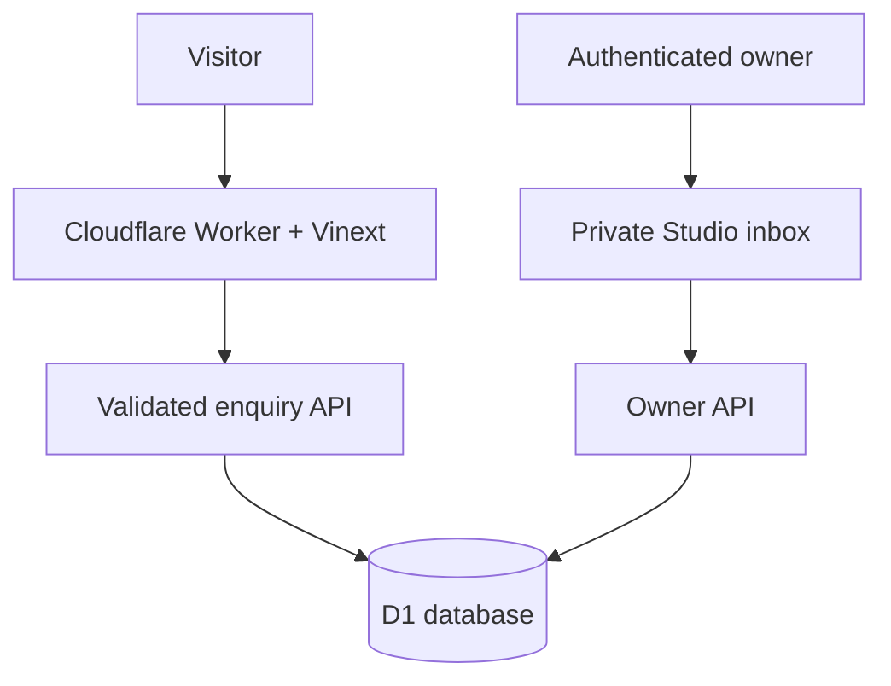

# ORBIT Studio

> Less busywork. More business.

ORBIT Studio is a production-minded AI automation agency website for ambitious businesses. It combines a cinematic, motion-aware landing page with an owner-only enquiry inbox backed by Cloudflare D1.

For the complete sanitized product history, architecture, deployment shape, current provider state and next-work handoff, see [OrbitFlow project context](docs/PROJECT-CONTEXT.md).

The client-operations implementation adds a secure `/portal` with leads, follow-up tracking, reusable workflows, persistent retries/alerts, onboarding, reporting and client-approved case-study drafts. See [client operations setup and limits](docs/CLIENT-OPERATIONS.md). These changes need a release and configured providers before they operate on the live site.

**Live site:** [orbit-automation-studio.mohitchoyal2002.chatgpt.site](https://orbit-automation-studio.mohitchoyal2002.chatgpt.site)<br />
**Inbox:** `/studio` (owner access only)

## Product surface

- Cinematic image/video hero with scroll progress, reveal motion and parallax.
- Accessible workflow demos, pricing cards, FAQs and enquiry dialog.
- Motion toggle plus `prefers-reduced-motion` and `prefers-reduced-data` support.
- Validated enquiry form with a durable reference number.
- Honeypot, minimum-fill timing, same-origin checks and bounded request bodies.
- Persistent, salted network rate limiting in D1.
- Idempotent retries so a client does not create duplicate enquiries.
- Private owner inbox with status filters, pagination, full briefs, reply links, updates and confirmed deletion.
- Privacy page, robots policy, sitemap and security headers.

Starting prices and workflow conversations are intentionally illustrative. The UI does not claim clients, testimonials or fabricated financial outcomes.

## Architecture



## Routes

| Route | Purpose | Access |
| --- | --- | --- |
| `/` | Marketing site and enquiry form | Public |
| `/privacy` | Data handling and deletion-request guidance | Public |
| `/studio` | Enquiry inbox | Authenticated owner |
| `/api/enquiries` | Create an enquiry | Public, guarded |
| `/api/studio/enquiries` | List, update or delete enquiries | Owner only |
| `/portal` | Client leads, workflows, onboarding, reports and consent | Explicit client membership or owner |
| `/api/operations` | Scoped client operations | Membership; owner-only administrative actions |
| `/api/intake/:client` | Idempotent server-to-server lead intake | Rotatable client-specific key |
| `/api/runner` | Process due jobs and monthly snapshots | Server runner secret and hosting access |
| `/robots.txt` | Crawler policy | Public |
| `/sitemap.xml` | Discoverable public routes | Public |

## Stack

- Next.js 16 + React 19 + TypeScript
- Vinext + Vite + Cloudflare Workers
- Cloudflare D1 with Drizzle ORM
- Tailwind CSS 4 and shadcn-style primitives
- Lucide icons and self-hosted Geist font
- Node's built-in test runner with SQLite-backed API tests

## Run and validate

```bash
# Install dependencies in a normal Node environment
npm install

# Start the local Vite/Vinext dev server
npm run dev

# Build the Worker and static assets
npm run build

# Build first, then run API, HTML and component tests
npm test

# Run the test suite without rebuilding
node --test tests/*.test.mjs

# Check lint rules
npm run lint
```

The managed Sites workflow uses `npm run install:ci` for a locked, bounded `npm ci`. The production build is created by `npm run build`; it does not require committing `dist/` or `.next/` because those folders are generated and ignored.

## Runtime configuration

Set these values in the hosting platform's server-side environment, never in client code or `.openai/hosting.json`:

| Variable | Purpose |
| --- | --- |
| `ORBIT_ADMIN_EMAIL` | Email allowed to open and mutate the owner inbox. |
| `ORBIT_RATE_LIMIT_SALT` | Random secret used to derive temporary network-rate-limit keys. |

`.env.example` documents the names without containing real values. The hosting manifest declares the logical `DB` D1 binding; Sites provisions the database and applies the checked-in Drizzle migration.

## Data and security notes

- Enquiries are stored only after the database write succeeds; the API never returns a false-success response.
- Public callers cannot list, update or delete records. Owner identity is checked server-side against dispatch-authenticated ChatGPT identity and the `ORBIT_ADMIN_EMAIL` allowlist.
- API and owner responses are marked `no-store`; owner pages are excluded from indexing.
- Security headers include a restrictive CSP, `X-Content-Type-Options`, `Referrer-Policy` and `Permissions-Policy`.
- The UI opens an email reply draft; it does not silently send email.
- WhatsApp, HubSpot and email adapters are implemented for client workspaces, but no live provider credentials or scheduled runner are connected. Payments, calendar booking, incoming/delivery webhooks and external AI providers remain outside this release. See the setup guide before activation.

## Database changes

```bash
npm run db:generate
```

Migrations are additive. Never rewrite a migration that has already been applied to production.

## Launch checklist

Before making the website public, confirm the real business identity, brand rights, contact details, pricing, privacy/retention obligations and target audience. Attach a custom domain and explicitly change the Site audience when the business is ready. Review `/studio` regularly and delete enquiries when they are no longer needed.

## License

This project is private/proprietary by default. Add a license file before redistributing it.

## Coaching admissions demo

A protected `/coaching` workspace now connects phone-based enquiries, CSV import, a guided course assistant, demo bookings/reminders and an admission pipeline. It is linked from the client portal. The Programmer’s Point preset uses synthetic data and simulated WhatsApp messages. Gemini can interpret unfamiliar demo questions without inventing course facts. Live WhatsApp requires provider credentials, approved templates, a recipient allowlist and the external runner.

See [Coaching demo and activation guide](docs/COACHING-DEMO.md) for the walkthrough, exact settings, test scope and operational limits. HubSpot contact sync requires an actual email; phone-only enquiries are retained without fabricated addresses.


## OrbitFlow website widget

Open `/tracking` as the owner, choose **Open dummy website**, then open the dummy coaching website in the Install tab. It records consented activity such as page views, scroll depth, course views, CTA clicks, form activity, video progress and widget enquiries. Use fictional student details; it sends no messages. For a real institute, create its coaching workspace and add its authorized exact HTTPS origins, privacy page, courses and retention. Copy the generated script before `</body>` in the host website template. A public site key never grants report access.

Optional interaction tags: `data-orbit-course="mern"`, `data-orbit-action="book-demo"`, `data-orbit-form="admissions"`, `data-orbit-video="course-intro"`. Course tags require at least 50% visibility. Form tags record interactions only, never field values. Contact data enters via the widget's submitted enquiry. For SPA-rendered course sections, call `window.OrbitFlowWidget.refresh()` after rendering. The public SDK also exposes `open()`, `privacy()`, `withdraw()`, `getStatus()`, and bounded `track("cta_click", {action:"book-demo"})` / `track("course_view", {course:"mern"})` calls.

The host CSP must permit `https://www.orbitflow.work` in script-src, connect-src and img-src. A nonce on the embed script is propagated to the widget style element; allow that nonce in style-src when inline styles are restricted. The loader uses HTTPS, CORS and Shadow DOM, and isolates its UI from host CSS. Tracking starts only after separate analytics consent. Enquiries work without analytics; WhatsApp opt-in is separate. Browser privacy signals, revocation retries, event IDs and schema validation protect the collection flow. No session replay, arbitrary field capture, fingerprinting or automatic discovery of phone numbers.

Events, sessions, consent and submissions are persisted in D1 by site/workspace. `/api/tracking?site=SITE_ID&export=events&days=30` returns an authenticated, paginated JSON export with `schemaVersion` and `nextCursor`; pass the latter as `after`. The export excludes contact fields and labels observed data as untrusted for future AI processing. No external AI analysis of this data is configured. Active reporting excludes expired activity; cleanup runs during session creation, the existing runner and manual cleanup.

## Google sign-in

The existing Sites ChatGPT authentication stays available. At the user's request, the app also implements a bounded Google OIDC authorization-code flow on separate `/api/auth/google/*` routes. It never replaces Sites-owned `/signin-with-chatgpt`, `/signout-with-chatgpt` or `/callback` routes or changes the site's public access policy. Google identifies a visitor; server-side owner and client membership rules still authorize access.

Set secret runtime values `ORBIT_GOOGLE_CLIENT_ID` and `ORBIT_GOOGLE_CLIENT_SECRET` from a Google **Web application** OAuth client. A Gemini API key does not enable sign-in. Configure Google Auth Platform branding as **OrbitFlow**, the homepage `https://www.orbitflow.work` and privacy URL `https://www.orbitflow.work/privacy`. For external testing, list permitted Google test users; move the consent app to production when it is ready for general external login. Scopes are only `openid email profile` (no Gmail mailbox permission).

Register these exact authorized redirect URIs in the same Google client:

```
https://admin.orbitflow.work/api/auth/google/callback
https://app.orbitflow.work/api/auth/google/callback
https://www.orbitflow.work/api/auth/google/callback
https://orbit-automation-studio.mohitchoyal2002.chatgpt.site/api/auth/google/callback
```

The server verifies RS256 signatures using Google's fixed JWKS endpoint, issuer/audience/authorized presenter, nonce, verified email and freshness. The flow uses PKCE, browser-bound one-use state, ten-minute flow expiry, hashed random session IDs and Secure/HttpOnly/SameSite=Lax host-only cookies. It accepts Gmail and Google Workspace identities for trusted email invitations. Google provider access tokens are not stored. Sessions last at most seven days and are deleted on sign-out; sign-out requires a same-origin POST. Each subdomain has its own session. Production cookie forwarding and a real Google account round trip must be verified after publishing; local tests use cryptographically signed test tokens, not real Google users.

Existing memberships already claimed with a ChatGPT identity stay pinned to it; signing in with Google does not silently link or overwrite that identity. Existing members can continue with ChatGPT. The owner may explicitly revoke and re-invite a member before they claim the invitation with their Google account. Owner access remains controlled by `ORBIT_ADMIN_EMAIL`.

Do not commit OAuth JSON downloads, provider secrets or local .env files. `/privacy` covers the widget and authentication data handling. Keep each institute's own privacy notice and declared data uses current.
