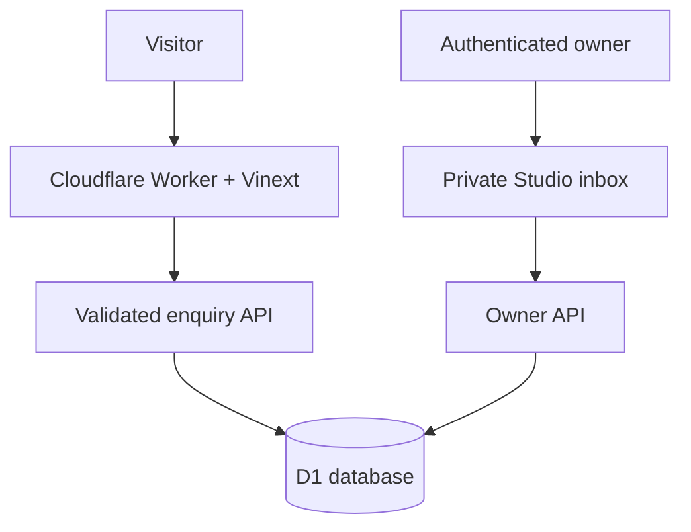

# ORBIT Studio

> Less busywork. More business.

ORBIT Studio is a production-minded AI automation agency website for ambitious businesses. It combines a cinematic, motion-aware landing page with an owner-only enquiry inbox backed by Cloudflare D1.

The client-operations implementation adds a secure `/portal` with leads, follow-up tracking, reusable workflows, persistent retries/alerts, onboarding, reporting and client-approved case-study drafts. See [client operations setup and limits](docs/CLIENT-OPERATIONS.md). These changes need a release and configured providers before they operate on the live site.

**Live site:** [orbit-automation-studio.mohitchoyal2002.chatgpt.site](https://orbit-automation-studio.mohitchoyal2002.chatgpt.site)<br />
**Inbox:** `/studio` (owner access only)

## Product surface

- Cinematic image/video hero with scroll progress, reveal motion and parallax.
- Accessible workflow demos, pricing cards, FAQs and enquiry dialog.
- Motion toggle plus `prefers-reduced-motion` and `prefers-reduced-data` support.
- Validated enquiry form with a durable reference number.
- Honeypot, minimum-fill timing, same-origin checks and bounded request bodies.
- Persistent, salted network rate limiting in D1.
- Idempotent retries so a client does not create duplicate enquiries.
- Private owner inbox with status filters, pagination, full briefs, reply links, updates and confirmed deletion.
- Privacy page, robots policy, sitemap and security headers.

Starting prices and workflow conversations are intentionally illustrative. The UI does not claim clients, testimonials or fabricated financial outcomes.

## Architecture



## Routes

| Route | Purpose | Access |
| --- | --- | --- |
| `/` | Marketing site and enquiry form | Public |
| `/privacy` | Data handling and deletion-request guidance | Public |
| `/studio` | Enquiry inbox | Authenticated owner |
| `/api/enquiries` | Create an enquiry | Public, guarded |
| `/api/studio/enquiries` | List, update or delete enquiries | Owner only |
| `/portal` | Client leads, workflows, onboarding, reports and consent | Explicit client membership or owner |
| `/api/operations` | Scoped client operations | Membership; owner-only administrative actions |
| `/api/intake/:client` | Idempotent server-to-server lead intake | Rotatable client-specific key |
| `/api/runner` | Process due jobs and monthly snapshots | Server runner secret and hosting access |
| `/robots.txt` | Crawler policy | Public |
| `/sitemap.xml` | Discoverable public routes | Public |

## Stack

- Next.js 16 + React 19 + TypeScript
- Vinext + Vite + Cloudflare Workers
- Cloudflare D1 with Drizzle ORM
- Tailwind CSS 4 and shadcn-style primitives
- Lucide icons and self-hosted Geist font
- Node's built-in test runner with SQLite-backed API tests

## Run and validate

```bash
# Install dependencies in a normal Node environment
npm install

# Start the local Vite/Vinext dev server
npm run dev

# Build the Worker and static assets
npm run build

# Build first, then run API, HTML and component tests
npm test

# Run the test suite without rebuilding
node --test tests/*.test.mjs

# Check lint rules
npm run lint
```

The managed Sites workflow uses `npm run install:ci` for a locked, bounded `npm ci`. The production build is created by `npm run build`; it does not require committing `dist/` or `.next/` because those folders are generated and ignored.

## Runtime configuration

Set these values in the hosting platform's server-side environment, never in client code or `.openai/hosting.json`:

| Variable | Purpose |
| --- | --- |
| `ORBIT_ADMIN_EMAIL` | Email allowed to open and mutate the owner inbox. |
| `ORBIT_RATE_LIMIT_SALT` | Random secret used to derive temporary network-rate-limit keys. |

`.env.example` documents the names without containing real values. The hosting manifest declares the logical `DB` D1 binding; Sites provisions the database and applies the checked-in Drizzle migration.

## Data and security notes

- Enquiries are stored only after the database write succeeds; the API never returns a false-success response.
- Public callers cannot list, update or delete records. Owner identity is checked server-side against dispatch-authenticated ChatGPT identity and the `ORBIT_ADMIN_EMAIL` allowlist.
- API and owner responses are marked `no-store`; owner pages are excluded from indexing.
- Security headers include a restrictive CSP, `X-Content-Type-Options`, `Referrer-Policy` and `Permissions-Policy`.
- The UI opens an email reply draft; it does not silently send email.
- WhatsApp, HubSpot and email adapters are implemented for client workspaces, but no live provider credentials or scheduled runner are connected. Payments, calendar booking, incoming/delivery webhooks and external AI providers remain outside this release. See the setup guide before activation.

## Database changes

```bash
npm run db:generate
```

Migrations are additive. Never rewrite a migration that has already been applied to production.

## Launch checklist

Before making the website public, confirm the real business identity, brand rights, contact details, pricing, privacy/retention obligations and target audience. Attach a custom domain and explicitly change the Site audience when the business is ready. Review `/studio` regularly and delete enquiries when they are no longer needed.

## License

This project is private/proprietary by default. Add a license file before redistributing it.
